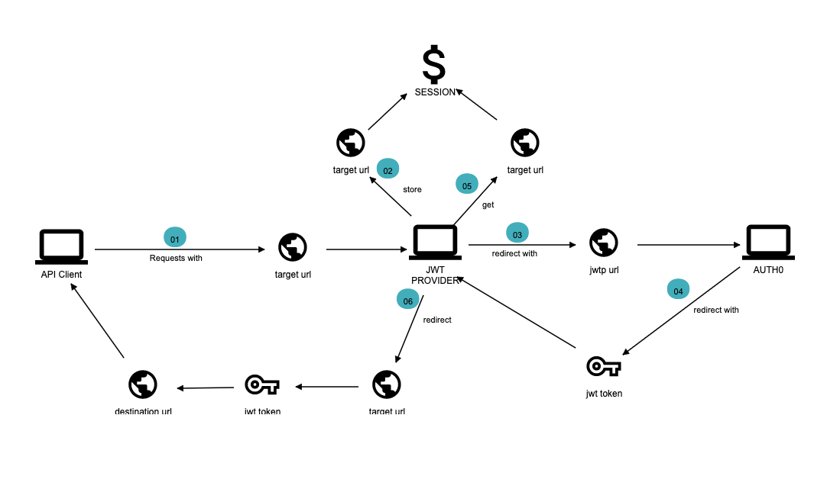

# JWT Provider
Application that provides JSON Web Tokens from UiTID v2 (Auth0)

# Architecture 
Code is split into Domain and Infrastructure. 

Domain contains actions, domain services (interfaces), value objects, etc... Infrastructure contains technical
capabilities to support the domain - mostly domain interface concrete implementation. The intention in this 
division is to decouple from Auth0, at least to some extent so further changes in Auth provider can be 
easier to implement.

`web/index.php` is the **entry point** for the application. It will pass the request to the
router that is defined in the `RoutingServiceProvider`, which is located in the `app` folder together 
with the rest of the Service Providers. Every route is tied to single action class that is located in the
`src/Domain/Action` folder.

# Authentication flow
jwt-provider service serves as a proxy between front end application and Auth0 service. 

